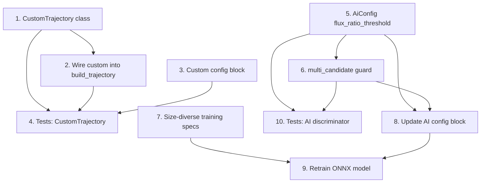

# Implementation Plan: Missing Features

## Overview

Two features are implemented here:
1. **Custom Trajectory** — add a `"custom"` motion type so users can select it without a crash.
2. **AI Component Re-enabling** — diversify training data, add a conservative invocation guard, re-enable the ONNX discriminator in config, and verify correctness.

## Tasks

- [x] 1. Add `CustomTrajectory` class to `src/sim/trajectories.py`
  - Implement `CustomTrajectory` as a subclass of `AnalyticTrajectory`
  - Motion model: linear drift + independent sinusoidal oscillation on each axis
    - `x(t) = x0 + velocity_x_px_s * t + amplitude_x_px * sin(2π * frequency_x_hz * t)`
    - `y(t) = y0 + velocity_y_px_s * t + amplitude_y_px * sin(2π * frequency_y_hz * t)`
  - Constructor: `def __init__(self, x0, y0, velocity_x_px_s, velocity_y_px_s, amplitude_x_px, amplitude_y_px, frequency_x_hz, frequency_y_hz, **kwargs)`
  - Forward `**kwargs` to `super().__init__(**kwargs)` for boundary handling
  - Implement `_evaluate(self, t: float) -> Tuple[float, float]` returning unconstrained `(x, y)`
  - Add full docstrings on the class and every method, with type hints on all arguments and return values
  - Add `"CustomTrajectory"` to `__all__` in the module
  - Register the class in `_REGISTRY` under the key `"custom"`

- [x] 2. Wire `"custom"` into `build_trajectory()`
  - File: `src/sim/trajectories.py`, function `build_trajectory()`
  - Add an `elif motion_type == "custom":` branch inside `build_trajectory()` alongside the existing `"linear"`, `"sinusoidal"`, `"random"`, etc. branches
  - Branch body: `params.setdefault("x0", x0)` and `params.setdefault("y0", y0)`
  - This ensures the initial position from config flows into the trajectory when the user has not specified `x0`/`y0` explicitly
  - Depends on: Task 1

- [x] 3. Add `"custom"` config block to `config/default.json`
  - File: `config/default.json`, under `target.motion`
  - Add the block at the same level as `"linear"`, `"circular"`, etc.
  - Parameters: `velocity_x_px_s: 80.0`, `velocity_y_px_s: 40.0`, `amplitude_x_px: 120.0`, `amplitude_y_px: 200.0`, `frequency_x_hz: 0.15`, `frequency_y_hz: 0.08`
  - Include a `_note` field describing the motion formula

- [x] 4. Write pytest tests for `CustomTrajectory`
  - File: `tests/test_custom_trajectory.py`
  - `test_initial_position` — `position_at(0.0)` returns `(x0, y0)` exactly (sinusoidal and drift terms are zero at `t=0`)
  - `test_deterministic` — `position_at(t)` called twice with the same `t` returns an identical result
  - `test_is_not_stochastic` — `trajectory.is_stochastic` is `False`
  - `test_boundary_clamp` — a trajectory with `boundary="clamp"` and tight `bounds` never returns coordinates outside those bounds across a sweep of `t` values
  - `test_build_trajectory_custom` — calling `build_trajectory(config)` with `motion.type == "custom"` does not raise and returns a `CustomTrajectory` instance
  - `test_known_position` — at a specific `t` where the expected value can be computed analytically (e.g. `t = 1.0 / frequency_x_hz / 4` where `sin(...) == 1`), assert the returned position matches within floating-point tolerance (`abs(result - expected) < 1e-9`)
  - Depends on: Tasks 1, 2, 3

- [x] 5. Add `flux_ratio_threshold` field to `AiConfig` in `src/config.py`
  - Add field: `flux_ratio_threshold: float = 1.5`
  - Add docstring entry: minimum flux ratio between the top two candidates that must be exceeded before the discriminator is skipped
  - In `AiConfig.validate()`, add: `_require(self.flux_ratio_threshold >= 1.0, f"ai.flux_ratio_threshold must be >= 1.0, got {self.flux_ratio_threshold}")`
  - Update `invoke_on` validation to also accept `"multi_candidate"`

- [x] 6. Implement `"multi_candidate"` guard in `CandidateDiscriminator.should_run()`
  - File: `src/ai/validator.py`, method `CandidateDiscriminator.should_run()`
  - Add a fourth mode `"multi_candidate"` alongside `"never"`, `"classical_failure"`, `"always"`
  - Condition: ≥2 candidates AND `detections[0].flux / detections[1].flux <= flux_ratio_threshold`
  - Guard division by zero: if `detections[1].flux <= 0`, treat ratio as infinity (do not invoke)
  - Add `flux_ratio_threshold` as a constructor parameter and instance attribute
  - Updated signature: `def __init__(self, session, invoke_on, confidence_threshold, max_inference_ms, flux_ratio_threshold: float = 1.5)`
  - Pass `ai_config.flux_ratio_threshold` when constructing `CandidateDiscriminator` in `load_discriminator()`
  - Update the method's docstring to document the new mode and flux-ratio condition
  - Depends on: Task 5

- [x] 7. Add size-diverse training specs to `scripts/train_ai.py`
  - File: `scripts/train_ai.py`, tuple `TRAIN_SPECS`
  - Append three new `VideoSpec` entries covering the full spec-mandated size range (5–20 px):
    - `tr_large_spot`: `width=960, height=720, frames=90, size_px=20.0, sigma_px=5.5, peak=200.0, background=15.0, gaussian_sigma=8.0, sp_density=0.05, bitrate_kbps=2000, motion="circular"`
    - `tr_medium_spot`: `width=800, height=600, frames=90, size_px=14.0, sigma_px=3.8, peak=180.0, background=12.0, gaussian_sigma=10.0, sp_density=0.07, bitrate_kbps=1600, motion="figure8"`
    - `tr_small_spot`: `width=640, height=480, frames=90, size_px=5.0, sigma_px=1.2, peak=160.0, gaussian_sigma=8.0, sp_density=0.08, bitrate_kbps=1200`
  - Update the module docstring comment near `TRAIN_SPECS` to note that specs now cover the full size range

- [x] 8. Update `config/default.json` AI block with safe defaults
  - File: `config/default.json`, key `"ai"`
  - Set `"enabled": true`
  - Set `"invoke_on": "multi_candidate"`
  - Set `"confidence_threshold": 0.65`
  - Set `"flux_ratio_threshold": 1.5`
  - Set `"max_inference_ms": 10.0`
  - Update or remove any `"_not_implemented"` note — replace with a comment that the discriminator is now live
  - Add `"_invoke_on_options"` listing all valid modes for documentation
  - Depends on: Tasks 5, 6

- [x] 9. Retrain the ONNX model
  - Run from the project root: `PYTHONPATH=. python scripts/train_ai.py --out models/discriminator.onnx --epochs 40`
  - Confirm the script exits with code 0 and prints `"ONNX vs NumPy max difference ... -> agrees"`
  - The retrained model replaces `models/discriminator.onnx`
  - Depends on: Tasks 7, 8

- [x] 10. Write pytest tests for the AI discriminator
  - File: `tests/test_ai_discriminator.py`
  - Tests that require an ONNX model must skip gracefully when `models/discriminator.onnx` is absent
  - `test_should_run_single_candidate` — `should_run([one_detection])` returns `False` for every `invoke_on` mode except `"always"`
  - `test_should_run_zero_candidates` — `should_run([])` returns `False` for all modes
  - `test_multi_candidate_skips_on_high_flux_ratio` — `invoke_on="multi_candidate"`, `flux_ratio_threshold=1.5`, `detections[0].flux=100.0`, `detections[1].flux=50.0` (ratio=2.0 > 1.5) → `should_run()` returns `False`
  - `test_multi_candidate_invokes_on_close_flux` — same setup but `detections[1].flux=80.0` (ratio=1.25 ≤ 1.5) → `should_run()` returns `True`
  - `test_multi_candidate_zero_second_flux` — `detections[1].flux=0.0` → `should_run()` returns `False` (division-by-zero guard)
  - `test_inference_does_not_crash` *(skip if model absent)* — load via `load_discriminator()` with `invoke_on="always"`, `confidence_threshold=0.5`, construct a synthetic 32×32 float32 patch, call `discriminator.rank(frame, detections)`, assert no exception and return type matches `(tuple | None, Detection | None)`
  - `test_never_mode_never_runs` — `invoke_on="never"` → `should_run()` always returns `False` regardless of candidate count
  - Depends on: Tasks 5, 6

## Task Dependency Graph

```json
{
  "waves": [
    [1, 3, 5, 7],
    [2, 6, 8],
    [4, 9, 10]
  ],
  "dependencies": {
    "2": ["1"],
    "4": ["1", "2", "3"],
    "6": ["5"],
    "8": ["5", "6"],
    "9": ["7", "8"],
    "10": ["5", "6"]
  }
}
```



## Notes

- Tasks 1–4 are fully independent of Tasks 5–10 and can be developed in parallel.
- Task 9 (retrain) requires a working video generation environment (`scenarios/generate.py`). If the training environment is unavailable, skip and document the gap.
- All tests in `tests/test_ai_discriminator.py` that load the ONNX model must use a fixture guard (e.g. `pytest.importorskip` or `pytest.mark.skipif`) so the test suite passes even when `models/discriminator.onnx` is absent.
- The `"multi_candidate"` mode is conservative by design: the AI is only invoked when classical flux ranking is genuinely ambiguous (close flux between top two candidates), keeping it off the hot path for unambiguous frames.
