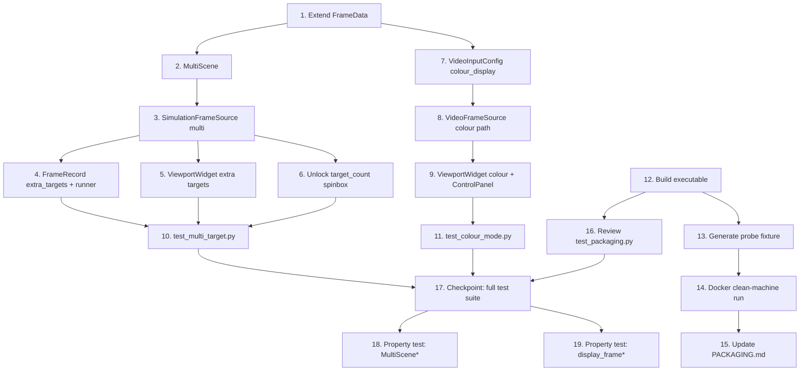

# Implementation Plan: Three Features (Multi-Target, Colour Mode, Clean-Machine Test)

## Overview

Three independent features implemented on top of the existing fsoc-tracker architecture.
Feature A adds simultaneous multi-target simulation while keeping every downstream consumer
unchanged via an optional `extra_ground_truths` field on `FrameData`. Feature B routes a
BGR display frame alongside the existing single-channel pipeline frame so the GUI can
render colour when the video source provides it. Feature C exercises the documented
clean-machine verification procedure and confirms the packaging artefact is complete.

All code is Python 3.12. No Qt imports in core modules (`src/sim`, `src/framesource`,
`src/video_source`, `src/telemetry`). No magic numbers — every tunable value lives in
`config/default.json` and reaches the code through typed dataclasses in `src/config.py`.

---

## Tasks

- [ ] 1. Extend `FrameData` with optional multi-target and colour-display fields
  - In `src/framesource.py`, add two new optional fields to the `FrameData` frozen dataclass:
    - `extra_ground_truths: Optional[List[GroundTruth]] = None` — additional target states
      beyond the primary (index 0) target; `None` when `target.count == 1`
    - `display_frame: Optional[np.ndarray] = None` — 3-channel BGR array for GUI display;
      `None` when the source is grayscale or simulation
  - Add `from __future__ import annotations` if not already present; add `List` to the
    `typing` imports
  - No changes to any consumer — `ground_truth`, `frame`, and all other fields are unchanged
  - _Requirements: Feature A §2 (extra_ground_truths), Feature B §1 (display_frame)_

- [ ] 2. Implement `MultiScene` in `src/sim/scene.py`
  - Add a `MultiScene` class to `src/sim/scene.py` that owns a `list[Scene]` (one per
    target) and a single shared `Canvas`
  - `MultiScene.__init__(self, scenes: list[Scene])`: the first scene's canvas is the
    shared canvas; every sub-scene must use that same canvas object
  - `MultiScene.step(dt: float) -> list[SceneState]`: clears the shared canvas once, then
    calls `scene.step(dt)` on each sub-scene **but** re-uses the canvas clear from the
    first call by not re-clearing between beacons; composite all beacons onto the one canvas
  - `MultiScene.from_config(cls, config: AppConfig, rng=None) -> MultiScene`: build `N =
    config.target.count` sub-scenes; derive a distinct `np.random.default_rng` seed for
    each sub-scene from the master seed (e.g. `rng.integers(0, 2**31)`) so each target gets
    different initial position and trajectory phase; share one `Canvas.from_config(config)`
  - `MultiScene.reset()`: calls `reset()` on every sub-scene and clears the canvas
  - Expose `canvas` as a property that returns the shared `Canvas`
  - Export `MultiScene` from `__all__`
  - _Requirements: Feature A §1 (MultiScene)_

- [ ] 3. Update `SimulationFrameSource` to use `MultiScene` when `target.count > 1`
  - In `src/sim/source.py`, replace the `self.scene: Scene` attribute with a union:
    when `config.target.count == 1` build a `Scene` exactly as before; when `> 1` build a
    `MultiScene`; store as `self._scene_impl` and expose `self.scene` as a property that
    returns the primary (index 0) sub-scene for all code that accesses `self.scene.canvas`
    or `self.scene.beacon` (only the canvas is used in `get_frame`)
  - In `get_frame()`, branch on `isinstance(self._scene_impl, MultiScene)`:
    - Single-target path: unchanged
    - Multi-target path: call `self._scene_impl.step(dt, ...)` to get `list[SceneState]`;
      use `states[0]` as the primary state (same logic as today); convert `states[1:]` to
      `GroundTruth` objects using `view.canvas_to_frame` for each; set
      `extra_ground_truths=extra_gts` on the returned `FrameData`
  - Handle beam-wander re-render for the primary target exactly as before; secondary targets
    use their `SceneState` positions directly (no per-target wander on extra targets)
  - Import `MultiScene` from `src.sim.scene`
  - _Requirements: Feature A §3 (SimulationFrameSource multi-target)_

- [ ] 4. Add `extra_targets` column to `FrameRecord` and update `runner.py` logging
  - In `src/telemetry/metrics.py`, add `extra_targets: Optional[str] = None` to `FrameRecord`
    (stored as a JSON-encoded string so the CSV stays flat; each entry is
    `{"x": float, "y": float, "visible": bool}`)
  - In `src/runner.py` `TrackingRunner.step()`, after building `record`, check
    `frame_data.extra_ground_truths`; if present, encode them to JSON and set
    `record.extra_targets` before passing to `self.logger.add(record)`
  - Because `FrameRecord` is a plain dataclass, add the field with a default of `None` so all
    existing construction sites (tests, telemetry tests) remain valid without changes
  - _Requirements: Feature A §5 (FrameRecord extra_targets)_

- [ ] 5. Draw extra-target overlays in `ViewportWidget`
  - In `src/gui/widgets.py` `ViewportWidget`:
    - Add class constant `EXTRA_TARGET_COLOUR = "#c792ea"` (purple)
    - Store `self._extra_truths: list[tuple[float, float]] = []` (reset in `update_frame`)
    - In `update_frame()`, populate `_extra_truths` from
      `outcome.frame_data.extra_ground_truths` (convert `GroundTruth.x/y` pairs)
    - In `paintEvent()`, after drawing the primary BEACON ring, loop over `_extra_truths`:
      for each point that passes `_in_frame()`, draw a ring in `EXTRA_TARGET_COLOUR` with
      the same 26 px diameter, and call `labelled()` with text `"BEACON 2"`, `"BEACON 3"`,
      etc.
  - _Requirements: Feature A §6 (ViewportWidget extra targets)_

- [ ] 6. Unlock `target_count` spinbox in `ControlPanel` (Feature A)
  - In `src/gui/controls.py` `_build_target_tab()`:
    - Change `self.target_count.setRange(1, 1)` to `self.target_count.setRange(1, 4)`
    - Update the `setToolTip` text to reflect that multi-target is now implemented
    - Update the camera-tab label row that currently reads
      `"monochrome FPA (colour not implemented)"` — it will be updated again in task 9,
      but for now leave it as a `QLabel` (no functional change needed here)
  - _Requirements: Feature A §7 (ControlPanel target count)_

- [ ] 7. Add `colour_display` field to `VideoInputConfig` and `config/default.json`
  - In `src/config.py` `VideoInputConfig`, add `colour_display: bool = False`; no
    validation needed beyond the existing field types
  - In `config/default.json`, under `"video_input"`, add `"colour_display": false`
  - No other config changes; `force_grayscale` remains unchanged (it governs the pipeline
    frame; `colour_display` governs the display frame)
  - _Requirements: Feature B §2 (config colour_display)_

- [ ] 8. Add colour display path to `VideoFrameSource`
  - In `src/video_source.py` `VideoFrameSource.get_frame()`:
    - After decoding `frame` (the BGR array from `self._capture.read()`), if
      `not self.force_grayscale` and the raw frame has 3 channels, assign
      `display_bgr = frame.copy()` (before converting to grayscale) — this is the BGR
      array for display
    - Continue with the existing grayscale conversion for the pipeline `frame`
    - Build `FrameData` with `display_frame=display_bgr` when it was captured, else
      `display_frame=None`
  - Add `colour_display` parameter to `VideoFrameSource.__init__` and wire it through
    `from_config` using `config.video_input.colour_display`; set `force_grayscale =
    not config.video_input.colour_display` so the two flags are consistent
  - _Requirements: Feature B §1 (VideoFrameSource colour path)_

- [ ] 9. Render colour display frame in `ViewportWidget` and add checkbox to `ControlPanel`
  - In `src/gui/widgets.py` `ViewportWidget.update_frame()`:
    - Check `outcome.frame_data.display_frame`; if it is not `None` and has 3 channels
      `(H, W, 3)`, build the `QImage` using `QImage.Format_BGR888`; otherwise keep the
      existing `Format_Grayscale8` path
    - The `display_frame` array must be made contiguous with `np.ascontiguousarray` before
      passing to `QImage`; stride = `width * 3`
  - In `src/gui/controls.py` `_build_mode_tab()`:
    - Add a `QCheckBox("colour display (Mode B)")` named `self.colour_display_check`
    - Default to `self.config.video_input.colour_display`
    - Add it to the form layout in the Mode B panel, below the ground truth row
    - In `overrides()`, add `"colour_display": self.colour_display_check.isChecked()` inside
      the existing `"video_input"` dict
    - Replace the static `"monochrome FPA (colour not implemented)"` label in
      `_build_camera_tab()` with `"monochrome FPA (colour display available in Mode B)"`
  - _Requirements: Feature B §3 (ViewportWidget colour), Feature B §4 (ControlPanel)_

- [ ] 10. Write `tests/test_multi_target.py`
  - Test that a `MultiScene` with `N=2` composites both beacons onto a single canvas
    (canvas pixel max is higher than a single beacon would produce)
  - Test that each sub-scene reports an independent `SceneState` (positions differ)
  - Test that `SimulationFrameSource` with `config.target.count=2` produces frames where
    `extra_ground_truths` has length 1
  - Test that `SimulationFrameSource` with `config.target.count=1` produces frames where
    `extra_ground_truths is None`
  - Test that `build_frame_source` with `count=2` returns a source that yields multi-target
    frames (use a short `config` with `duration_seconds=0.1`)
  - Use `AppConfig.from_dict` with overrides; no magic numbers
  - _Requirements: Feature A §9 (tests)_

- [ ] 11. Write `tests/test_colour_mode.py`
  - Create a synthetic 3-channel `(H, W, 3)` BGR array as a fake video frame; write it to a
    temporary `.mp4` via `VideoFrameSource` or inject directly by patching `_capture.read`
  - Test that `VideoFrameSource` with `force_grayscale=True` (or `colour_display=False`) sets
    `display_frame=None` on returned `FrameData` and `frame.ndim == 2`
  - Test that `VideoFrameSource` with `force_grayscale=False` (or `colour_display=True`)
    sets `display_frame` to a 3-channel array and `frame.ndim == 2` (pipeline frame stays
    grayscale)
  - Test the `ViewportWidget` `QImage` format selection: mock or stub the widget's
    `update_frame` path; verify that a `FrameData` with a 3-channel `display_frame` causes
    the pixmap to be built with shape `(H, W * 3)` stride or `Format_BGR888`; verify that
    `display_frame=None` falls back to `Format_Grayscale8`
  - _Requirements: Feature B §5 (tests)_

- [ ] 12. Build the headless executable for clean-machine verification
  - Run `scripts/build.sh --clean` from the project root to produce a fresh
    `dist/fsoc-tracker`
  - Confirm the executable exists and is non-empty: `test -f dist/fsoc-tracker && ls -lh dist/fsoc-tracker`
  - Run `dist/fsoc-tracker --selftest` on the build host to confirm the lean build passes
    before attempting the container test
  - _Requirements: Feature C §1 (build executable)_

- [ ] 13. Generate the Mode B probe fixture
  - Run the Python one-liner from `docs/PACKAGING.md` Step 0 to produce
    `dist/clean_probe.mp4` and `dist/clean_probe_truth.csv`:
    ```
    python -c "
    from pathlib import Path
    from scenarios.generate import VideoSpec, generate_video
    generate_video(VideoSpec('clean_probe', width=640, height=480, frames=60,
                             gaussian_sigma=8.0), Path('dist'))
    "
    ```
  - Confirm both files exist: `ls -lh dist/clean_probe.mp4 dist/clean_probe_truth.csv`
  - _Requirements: Feature C §2 (generate fixture)_

- [ ] 14. Run Steps 1–7 from `docs/PACKAGING.md` in an `ubuntu:24.04` Docker container
  - Execute the full clean-machine procedure; capture stdout/stderr from each step
  - Step 1: `docker run --rm -it -v "$PWD/dist:/opt/fsoc:ro" ubuntu:24.04 bash`
  - Steps 2–7 inside the container as documented in `docs/PACKAGING.md`
  - Record the frame count from `grep -vc '^#' /root/logs/frames.csv`; it must equal 61
    (header line + 60 video frames from `clean_probe.mp4`)
  - If the frame count is wrong, note the actual count so `docs/PACKAGING.md` can be
    updated accurately rather than silently
  - _Requirements: Feature C §3 (docker run steps 1–7)_

- [ ] 15. Update `docs/PACKAGING.md` verification table
  - Locate the verification table in `docs/PACKAGING.md` (the rows for `ubuntu:24.04` and
    `debian:12` currently say "not yet run")
  - Update the `ubuntu:24.04` row with the actual result from task 14 — either "verified"
    with the date, or the failure mode observed
  - If the container run exposed a packaging issue, document the failure mode in the table
    footnotes (the doc's stated policy: "stated honestly rather than implying general
    portability")
  - Do not update the `debian:12` row unless that container was also run
  - _Requirements: Feature C §4 (update PACKAGING.md)_

- [ ] 16. Review and update `tests/test_packaging.py` for the probe fixture
  - Read `tests/test_packaging.py` to confirm that
    `test_frozen_build_decodes_video_without_ffmpeg_on_path` already handles a 60-frame
    fixture (its current fixture is 45 frames; the probe is 60)
  - If the test hard-codes the frame count, either make it configurable or add a second
    parametrized test case for the `clean_probe` fixture at 60 frames
  - Confirm that `grep -vc '^#' /root/logs/frames.csv` yielding 61 is consistent with
    the test's assertion (`len(rows) == spec.frames + 1`); update the assertion comment if
    needed
  - Run `pytest tests/test_packaging.py -v --run` to confirm the non-`@requires_build`
    tests still pass after any edits
  - _Requirements: Feature C §5 (test_packaging.py review)_

- [ ] 17. Checkpoint — run the full test suite
  - Run `pytest tests/ -v --ignore=tests/test_packaging.py -x` (excluding the slow
    packaging tests to keep CI fast) and confirm all tests pass
  - Fix any failures introduced by tasks 1–11 before proceeding
  - Pay particular attention to `test_framesource.py`, `test_scene.py`,
    `test_telemetry.py`, and `test_video_mode.py` — these are most likely to be affected
    by the `FrameData` and `FrameRecord` changes
  - Ensure all tests pass, ask the user if questions arise

- [ ]* 18. Write property test for `MultiScene` canvas compositing invariant
  - **Property: Multi-target compositing does not lose beacons**
  - *For any* `N ∈ {1, 2, 3}` targets, after one `MultiScene.step()` the canvas max
    intensity must be strictly greater than the background level, and the canvas must
    contain at least `N` local maxima separated by more than `beacon.size_px` pixels
  - Use `hypothesis` with `st.integers(min_value=1, max_value=3)` for target count
  - Tag: **Feature: three-features, Property 1: multi-target compositing preserves all beacons**
  - _Requirements: Feature A §9_

- [ ]* 19. Write property test for `FrameData` display/pipeline frame consistency
  - **Property: Pipeline frame is always single-channel regardless of display mode**
  - *For any* valid frame array shape `(H, W, C)` with `C ∈ {1, 3}` and any value of
    `force_grayscale`, the `FrameData.frame` produced by `VideoFrameSource.get_frame()`
    must satisfy `frame.ndim == 2`; when `C == 3` and `force_grayscale=False`,
    `display_frame.ndim == 3`
  - Use `hypothesis` with generated image arrays
  - Tag: **Feature: three-features, Property 2: pipeline frame is always grayscale**
  - _Requirements: Feature B §5_

---

## Notes

- Tasks marked with `*` are optional and can be skipped for a faster MVP
- Tasks 1–11 are pure-Python changes; no shell commands needed beyond the test runner
- Tasks 12–15 require Docker and `ffmpeg` on the build host; they cannot be automated in CI
  without those dependencies
- Feature A's design deliberately keeps `runner.py`, all filter code, and all existing tests
  unchanged: `extra_ground_truths` is optional with a `None` default, so all existing
  `FrameData` construction sites are unaffected
- Feature B's `display_frame` follows the same pattern: `None` default, consumers must
  check before using it
- The `target_count` spinbox range change (task 6) only affects the GUI; the config
  validation in `src/config.py` already accepts `count >= 1` (no upper-bound spec limit)
- Task 3 makes `SimulationFrameSource.scene` a property rather than a plain attribute;
  check `tests/test_scene.py` and `tests/test_canvas.py` for any direct `.scene` accesses
  that may need updating

## Task Dependency Graph

```json
{
  "waves": [
    { "id": 0, "tasks": ["1"] },
    { "id": 1, "tasks": ["2", "7"] },
    { "id": 2, "tasks": ["3", "8"] },
    { "id": 3, "tasks": ["4", "5", "6", "9"] },
    { "id": 4, "tasks": ["10", "11", "12"] },
    { "id": 5, "tasks": ["13", "16"] },
    { "id": 6, "tasks": ["14"] },
    { "id": 7, "tasks": ["15", "17"] },
    { "id": 8, "tasks": ["18", "19"] }
  ]
}
```


